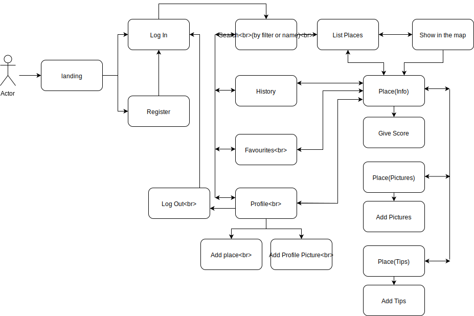
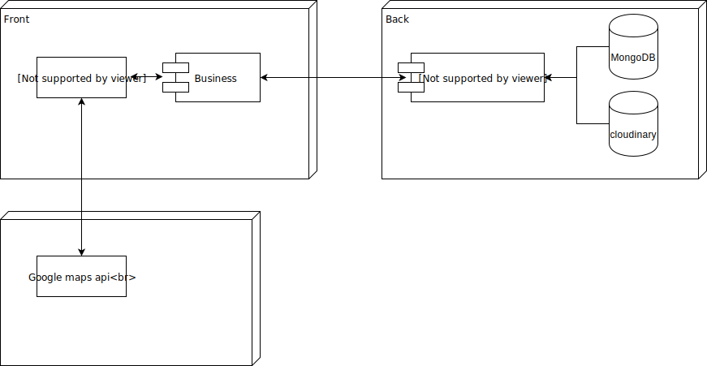
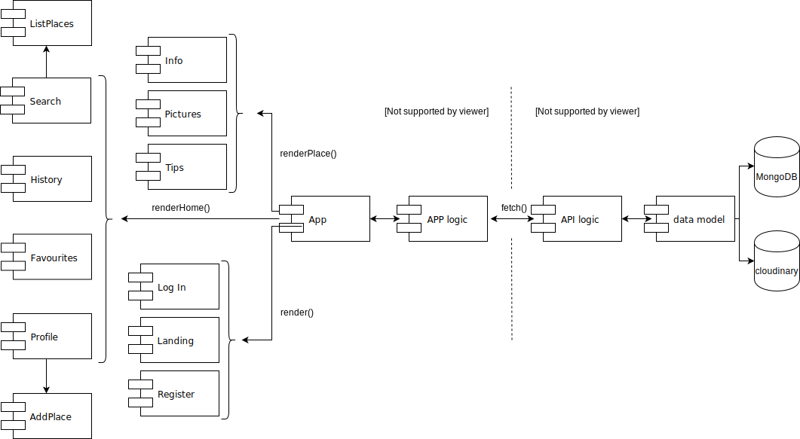
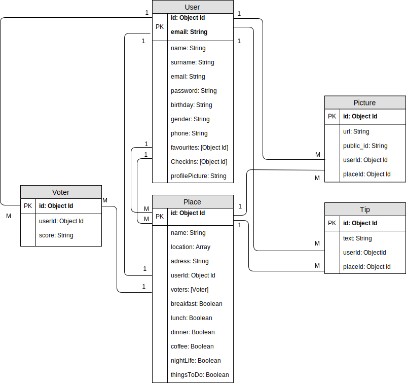
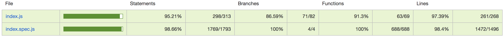

# **Skysquare**

## **Introduction**

#### *Skysquare makes easy to enjoy the city.* 
#### *With our app, you can look for the best spots around you, add your awesome pictures and give tips to other experience hunters. Restaurants, coffee places, clubs, parks, cinemas, ...   you can find everything you are looking for!*
#### *Welcome to the best city hightlights and enjoy with skysquare city guide!*

## **Functional description**

When the user enter the **landing**, can choose to make a new **register** and/or **log in** with a existent user.

After the authentication, the user will be redirected to the **search** section. Here, the user can also have access with the bottom navbar to **history**, **favourites** and **profile**. 

In the **search** section, the user can look for places by filter or name. The results are then listed by nearness according to the user geolocation, and can also be seen in a map. Either from the list or the map, the user can go to the information of each place with one click. 

The general **info** section show the place score and location, and allows to give a score or save it in the user favourites or check-in places. From the superior navbar, the user can also access the place **pictures** and **tips**, where it is possible to add new items. 

In the **history** and **favourites** sections, the user can see a list of his/her selected places. With one click, they can go to the information of each place.

In the **profile**, the user can see all his/her pictures and tips, **add a profile** pictures, and **add new places**.

## **Functional description**

## **Tecnical description**

Skysquare is designed for mobile. The front is created using ReactJs, the back is based on nodeJs, Express and the data is storaged in cloudinary and MongoDB with mongoose.

Written in Javascript, with some feature of ES6 and ESNext. It also uses Google Maps Api, moments and sessionStorage.

The design is implemented with SASS and BEM. 

### *Block diagram*

### *Component diagram*

### *Data model diagram*

### *Api test coverage*

